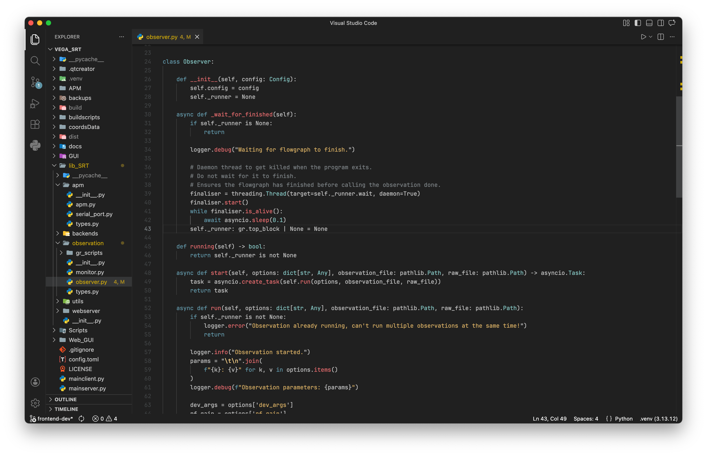

# Lausanne
A simple dark theme for Visual Studio Code.

 

## Variants
- **Lausanne**, the classic version 
- **Lausanne Minimal**, which hides all text in the titlebar (useful on MacOS, where the titlebar doesn´t contain much)